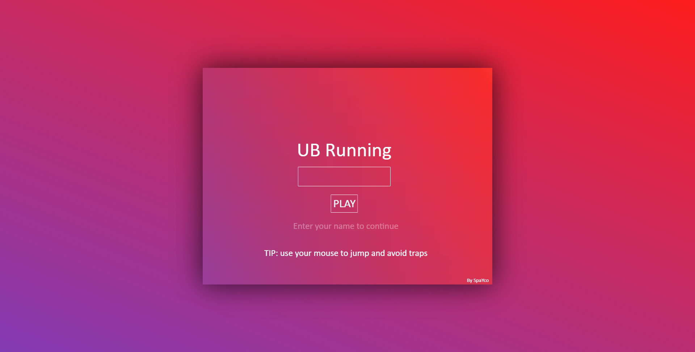
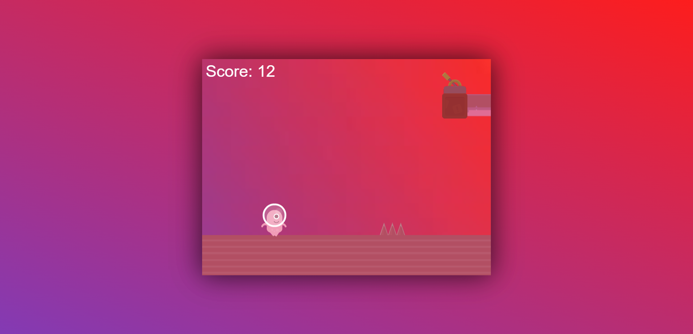

 [![Contributors][contributors-shield]][contributors-url]
[![Forks][forks-shield]][forks-url]
[![Stargazers][stars-shield]][stars-url]
[![Issues][issues-shield]][issues-url] 

[contributors-shield]: https://img.shields.io/github/contributors/Spayco/UB-Running.svg?style=flat-square
[contributors-url]: https://github.com/Spayco/UB-Running/graphs/contributors
[forks-shield]: https://img.shields.io/github/forks/Spayco/UB-Running.svg?style=flat-square
[forks-url]: https://github.com/Spayco/UB-Running/network/members
[stars-shield]: https://img.shields.io/github/stars/Spayco/UB-Running.svg?style=flat-square
[stars-url]: https://github.com/Spayco/UB-Running/stargazers
[issues-shield]: https://img.shields.io/github/issues/Spayco/UB-Running.svg?style=flat-square
[issues-url]: https://github.com/Spayco/UB-Running/issues
# UB-Running

> A Platform Game Made With Phaser

# Story

> SpaYso went for a trip to look for her partner SpaYco, but their enemy Ractive is trying to stop her! help her by jumping before the trap reaches SpaYso!

## Built With

- HTML
- SASS
- JavaScript
- WebPack
- Babel
- Phaser

## Live Demo

[Live Demo Link](https://ub-running.netlify.app/)

## Getting Started

- `npm install`
- open `index.html` from the `dist` folder

## Making Changes

- if you wanna make changes do them on the src folder 
- if you want to preview changes live use `npm start` from your terminal
- when you finish your changes, run `npm run build` to create the production files to the dist folder

## Testing

In Order To Test Follow These Steps:

- `npm install`
- `npm test`

> All Tests Are In The Test Folder, The Mock Folder Is For Mocks That Jest Needs In Order To Work In This Particular Case.

## Authors

👤 **SpaYco**

- Github: [@SpaYco](https://github.com/SpaYco)
- Twitter: [@iSpaYco](https://twitter.com/iSpaYco)
- Linkedin: [Aziz Mejri](https://linkedin.com/in/spayco)

## 🤝 Contributing

Contributions, issues and feature requests are welcome!

Feel free to check the [issues page](issues/).

## Show your support

Give a star⭐️ if you like this project!

## 📝 License

This project is [MIT](http://www.opensource.org/licenses/mit-license.php) licensed.
